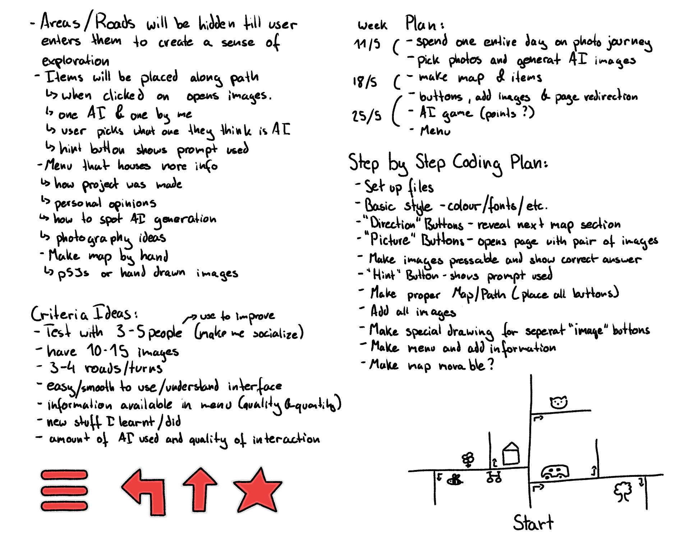
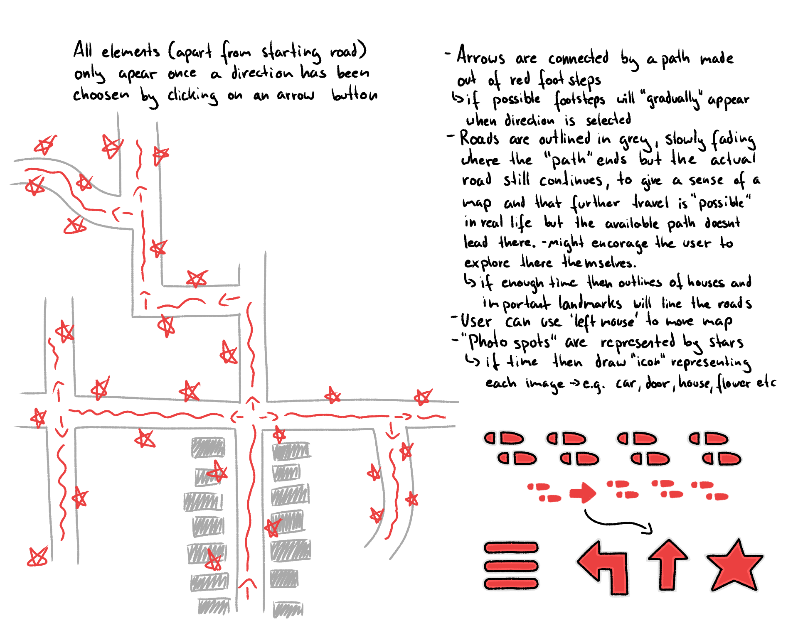
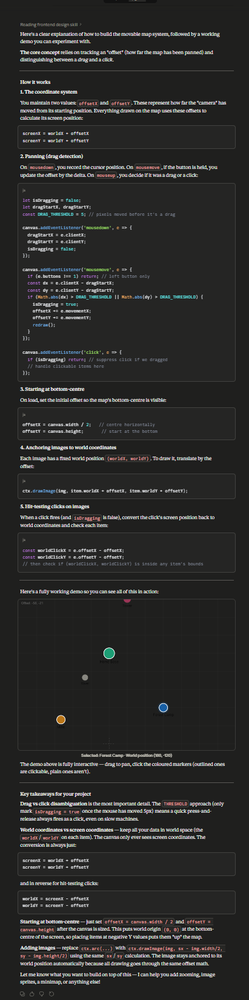
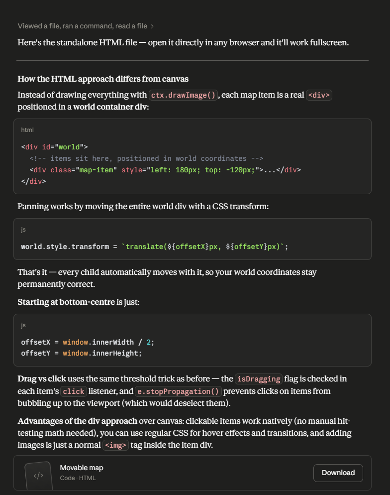

# mddn-project-3
Interactive self made map that show cases my photography and doubles as a 'What image is AI' game   

For this project I will be using p5 since I already know how it works and dont need to spend a lot of time learning new things which is important due to the scope of this project being lowered since i am hand coding everything and also having to hand the project in a week before it is actually due. Additionally this will alow me to focus more time and energy on the  AI image generation side of this project.   
The original plan was to use HTML and CSS since i wanted to focus on learning more in the coding side of things but my priorities shifted once the decision was made to not use AI for the coding side of things.   

Original Plan:   
    
    

New Plan with shifted priorities due to shorter time and hand coding everything:   
    -all visuals are in a red, hand drawn style (hand drawn style is more forgiving regarding 'errors' in the drawn map)   
    -static hand drawn map (no longer movable since it is not possible due to time and hand coding)   
    ⤷ arrows where the path 'turns' - when clicked shows next path in chosen direction   
    ⤷ arrows connected with a path of footsteps (if enough time)   
    ⤷ grey outline of roads and houses (houses only if enough time)   
    ⤷ stars where images are taken. area can be clicked to open 'image widget'   
    -the image widget has two versions: some with AI guessing game and other just the image taken by me   
    ⤷ hint button which shows prompt used for AI image generation   
    ⤷ title of image (and 'What one is AI' if guessing game)    
    ⤷ button that shows image info (camera settings and approx location)   
    ⤷ back button to close widget   
    -menu button (if enough time)   
    ⤷ has info on how to spot AI (linking to external websites)  
    ⤷ info on how and why project was made  
    ⤷ photography ideas  
    

References, Inspirations and 'similar' projects   
    My 'yellow journey' project from dsdn 151 where i went on a 'photography journey' and took pictures of everything yellow   
    My 'humble abode website' project for ths course: using a project to show case my work (in this case photography)  
    https://flowchart.bettercatastrophe.com/Links    
    https://counterhate.com/spot-the-fake/Links   
    https://fake-or-real.net/Links   
    https://fake-or-real.net/blog/comment-detecter-image-ia.htmlLinks   

Criteria:   
    -Quality of interface   
    ⤷originally: smooth 'movement' and easy to understand without much instructions  
    ⤷with new priorities: cohesive style and clear visuals that easily communicate how to interact with elements. good layout and use of space (important since map is no longer movable so everything needs to be easily seen without zooming in).  
    -Size and quality of map   
    ⤷goal is about 3-4 turns and 10-15 images with self drawn icons as buttons  
    -Quality of fun had during project   
    ⤷i want to mash all the processes I enjoy (photography, coding, drawing, walking and play-testing with friends) into this project and focus on having fun while learning new things. This also lines up with my current 'life goal' on focusing more on my wellbeing and not letting perfectionism and my own expectations get in the way of it.  
    -Quality and quantity of overall things I learnt  
    ⤷ originally: i want to learn new things that i can pull from and adapt to help me when making future project to avoid having to do a whole bunch of research or ask AI for help every single time. Basically the ultimate goal is to have enough knowledge to build a project on my own without outside help and i want to use this project to build this knowledge  
    ⤷ current definition: 'things i learnt' is in regards to the entire project so includes things learnt about photography and editing, Ai image generation and prompting, my personal 'relationship/opinions' on AI and how I want to use/work with it, map drawing, Ui design, coding knowledge etc   
    -Amount of socialization done   
    ⤷another current 'life goal' is to interact more with people and I want to use this project as a way to help me with that: e.g. getting people to user-test, give me feedback (this will also help me work on taking criticism better) and taking a friend with me while I do my photography journey  

Notes:   
13/5   
    started making basic files   
    came to the conclusion that i may have to use AI for this project after all since i cant just re-use the code from my previous projects since it doesnt create the interaction I am aiming for.   
    I may first try to look online to see what i can find or if another Human can teach me and then re-evaluate. Overall a little disappointed but here we are   
20/05   
    I decided to use AI for this project rather than just pulling from what I already know since it will alow me to get the project done in time and hopeful help me reach a standard that I am happy with. Im still not very pleased about this but at the end of the day the course is called 'AI CODING' so that so what i am expected to do. I was really hoping that I could use this course to learn/ teach myself coding but that doesnt seem to be the case. So currently I am just 'accepting my fate' and 'using as much AI as i need' for this project. I will still keep the same approach of asking it to help me make certain parts of my project that I then piece together rather than just having AI make the whole thing since that goes too much against what I stand for as a person and what i think gives design/ creativity its value. Plus that way i still have some control and input.  
22/05   
    new decision: no ai for making code.   
    After a lot of back and forth i decided to not use AI for the coding side of this project. This decision made me a lot happier since I will be able to 'test' my coding knowledge and also do some more 'non AI' problem solving and researching which i wasnt able to do in my previous projects of this course since it was my way of integrating AI but in this project I am already using a lot of it in the image generation process so Im 'sorted' in the Ai area. When deciding this it felt like a big weight fell off of me since it meant that i could finally do what i was hoping for doing in this course in the first place and also meant that I that i could make something that is 'truly mine'. I can now also avoid a huge amount of 'banging my head against the wall' and dread i feel for working with AI due to it doing things wrong and backtracking.   

Overall Notes:   
    As much as I have 'complained' about this course i am still glad that i took it since it gave me the opportunity (aka gently forced me) to work with AI which I wouldn't have done on my own not in other courses. I have learnt a lot about my opinion on AI and that I am a person who doesnt like working with it but I now understand a little better why people might like working with it so much. It was also an interesting way to see how AI can be used while also showing me that it wont be a 'real threat' to me and fellow designers.   

Images:  
    Went to the Broklyn in wellington with a 'Canon EOS 760D' and took pictures of everything red that i found interesting. A friend came with me and it was really great to just walk around and take images of the small things of our surroundings. Its a nice 'activity' to do to get out of the house and having something more 'enriching' and 'adventurous' to do while chatting and catching up with a friend rather than just sitting somewhere   
    All images mapped out:   
    
    Next step is to take these and make 'AI versions' of them. I will start with the images at the beginning of the path aka the bus stop on Ohiro road.   

Notes on making 'AI verions' og photos:   
        -need to specify image size to be the same as images I took   
        -cant just ask it to ‘replicate’ images or ‘make own version of image’ or ‘make a similar image’ since it just make a small change e.g. lighting to the provided image which is not enough change for purpose of this project   
        -making a new chat for each question/ image so that it isn’t influenced from previous prompts or images given   
    Using Gimini – 3.5 flash – standard thinking level - free version   
        -kept having issues: ‘I'm being asked for a lot of images right now, so I can't create that for you. Can you ask again later?’   
        -asking for slightly wider image so that I could crop out the water mark   
    ChatGPT   
        -doesn’t have a water mark?!   
        -was sometimes asking me to pick between 2 images to /give feedback on the new version of ‘chatGPT’   
        -after 24 images it ran out and i have to wait 24 hours: You’ve reached your image creation limit. Upgrade to ChatGPT Plus or try again tomorrow after 12:39 PM.   
        -apart from the first time generating images it always ran out after 4-5 image and then id have to wait 24 hours.   
        -its helps a lot to say 'new zealand' and 'suburban' to get the same feeling and look as the images I took. It is very interesting how much this information changes the output/ image   
        -tested using long and short prompts to see how big of a difference it made  

Using Claude - Sonnet 4.6   

Asking AI to figure out if 'moving the map' is possible:   
    prompt:   
        Hello!   
        I am starting a new project and want to make something like a 'map' where the user can move the map around by holding down the left mouse button, similar to how google maps works.    
        The 'map' should work similar to a canvas so that i can add images and anchor them to certain points on the map so that they stay where they are.   
        I also want the 'map' to start at the bottom middle of this canvas.    
        Some of the images will be clickable with left mouse button so the 'map movement' cant interfere with any other mouse clicks etc.   
        Can you tell me  how to make the 'movable map' part of my idea?   
        Please let me know if you have any questions or need more information.   
    AI Answer:   
           
    My Response:   
        I really liked that it gave me a 'working demo'. It looks pretty good and basically works exactly how I want it to   
        I forgot to specify to make it in HTML so sent a second prompt asking it to show me how to do it in HTML   
    AI Answer:  
           
        Gave me an HTML file which i have added to this project to easily reference here and show what of my code is "AI made":   
        [text](movable-map.html)   
    My Opinion:   
        I am honestly very overwhelmed by this big file so I will spend some time analyzing it and 'taking it apart' to figure out what does what and how i can implement it into this project.   
    

Project development without AI use:   
    -Started by setting up basic files that loads p5 into html. (referencing basic files using for project 2)   
    -Hand drawing the individual parts of the map   
    ⤷ I chose to hand draw the map rather than drawing it with p5 since i am going for a 'hand drawn style' and since it will be a lot quicker than individually plotting all points.  Additionally using an image makes the map easier to scale to different window sizes. I also really enjoy drawing maps so this adds to the 'having fun criteria'.   
    ⤷ i started with drawing the entire map to have as a reference image. then divided it up into the different sections (roads and turns) which i then imported as individual images to allow me to toggle them on and off to make the 'exploring' function.   
    ⤷ the map is positioned to always be at the centre of the window and scales with the windows width. The image posX, posY, width and height are all stored as variables. (need to be set in/after the set up function so that the window size w and h can be used since they are first declared in the set up function)   
    - ran into an issue:   
        when adding the arrow icons I realized that the size of the map meant that the icons would be very small and cramped which i dont like as it will seem messy and not well thought out.  
        
        My first idea was to just cut one of road off so that the map would be able to be more zoomed in. However this would mean to have less images and turns, and also would get rid of some of my favorite images.   
        
        ^ rectangle represents possible new sections   
        My second idea was to divide the map into sections and 'swap' between the different sections when the user presses a corresponding button. I really like this idea since it allows me to make the map bigger and be able to show more detail but also reintroduces the 'movable map' idea which i was so excited about when first starting this project. It is definitely more complicated than just having one big map but will also give a more unique user experience. To make sure that I dont sink too much time into figure out how to do this I will set myself a 1hour timer and see how far I get to the re-evaluate if this approach is worth it and scope appropriate.   
        
        ^ rectangles represent different sections   
        ⤷ good solution. Im very happy with it as it is very simple to implement and basically uses the same logic as before but now when a certain area is clicked it swaps sections rather than just showing/toggling the next section. It is currently a very abrupt change so I want to add a transition where the images fade and slide away/in to view. However I will first work on the image pop ups since that its more important for the completion of the project at this point.    
        ⤷ had another thought of just doing one big image of which i change the x and y pos when an arrow is clicked. The issue with this is that it will look different on every window size and therefore hard to trouble shoot and make sure that it looks as intended at every size. Additionally there would be an issue with arrow placement. I could either anchor them to a specific point on the map but on big/tall window sizes it would not be at the edge of the window but may be in the middle of the window. The other option would be to anchor them to the edge of the screen but im not the happiest with the look of that since i would like the arrows to be nested inside a road. Overall its too many issues to trouble shoot in such a small time so I will stay with the 'individual section images'   
    -added basic 'star button'. currently it just opens the image. next is to build the actual widget/pop up.    
    -talked with phoebe about how to do 'area pressed' logic without using so many if statements. The solution was to use arrays from a JSON file that stores the applicable information for each star.   
        -link for how to format JSON files: https://stackoverflow.blog/2022/06/02/a-beginners-guide-to-json-the-data-format-for-the-internet/   
        -how to add JSOn to p5: https://p5js.org/examples/loading-and-saving-data-json/
    -theoretically figured out how to do a 'hover state': using similar logic to 'mouse clicked' it just checks if the mouse is in a specific area and then does something e.g. change a buttons colour or outline etc. Currently only tested this with a 'console.log' but in theory it should work without issue. One 'issue' is that the user has to press somewhere on the window/tab for it to work but this could be solved by adding a 'start journey' button at the very beginning which would also add to the user experience.   

    
    
    